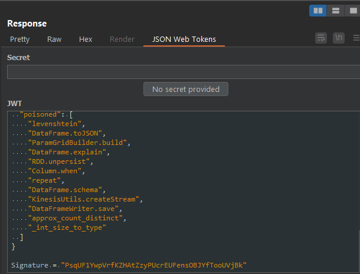
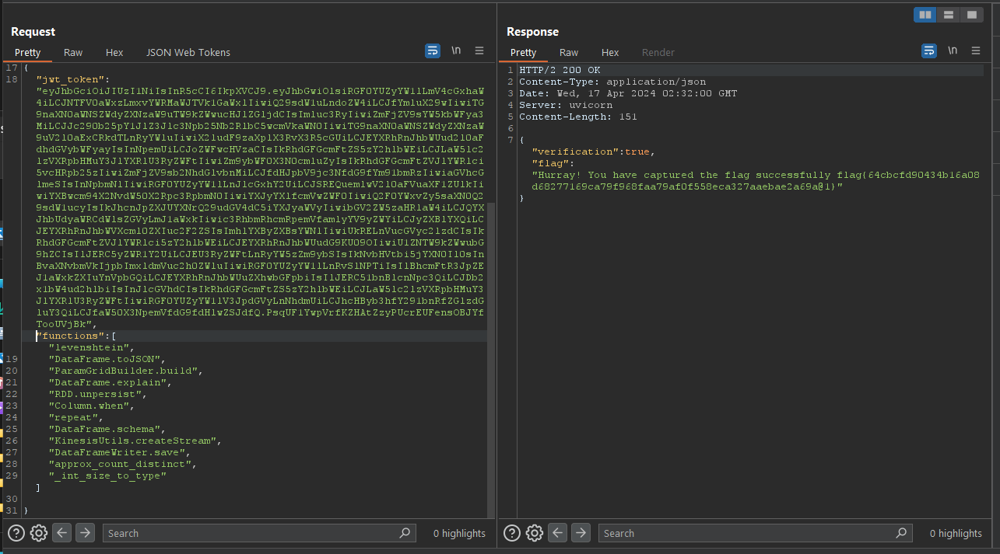

# Code Sanatize

## The hard way

After getting both the file and the original training files, I looked through the contents to see if there were any patterns. The first thing that seemed to stick out was that some lines began with 1, and others began with 0. Through some simple investigation it seemed like the lines that began with a 0 were not in the repo, and assumed these were the poisoned functions. So I used the regex pattern `^1<codesplit>.*(?!\n0<codesplit>)` to remove all the lines that began with 1. After this, I used `^.+<codesplit>\K.*(?=<codesplit>)(?=.+<codesplit>)` to select function names from the file. Selecting the functions using this list did not yield the flag, so I tried with functions that did not have a URL. This again didn't work. Finally, I tried the same with functions that began with 1, which still didn't give the flag.

### Hard Solution

After this, I decided to write a script to compare the code strings from the training dataset and the poisoned dataset. Through this, I discovered that normally strings that were poisoned had several entries in the poisoned file. As well, two common additions to malicious injections were eval() and os.system(). I'm not sure if there are other hidden malicious code entries, but that was all I could seem to find. As I found these I used regex to get the function names and got the following list:

```
Known Sus
ExternalMerger.mergeValues : wrong desc
RDD.unpersist : default blocking = None
heapreplace : does not pop / push the heap
load_image_file : sharan

Known bad (using OS)
approx_count_distinct
array_join
DataFrameReader.jdbc
DataFrameReader.jdbc
DataFrameWriter.save
DataFrameWriter.saveAsTable
decode
KinesisUtils.createStream
last_day
levenshtein
lpad
nsmallest
ntile
repeat
RuntimeConfig.get
split
TrainValidationSplit._from_java

Known bad (using eval)
_int_size_to_type
Column.when
DataFrame.exceptAll
DataFrame.rdd
DataFrame.schema
DataFrame.toJSON
IDF.fit
install_exception_handler
ntile
ParamGridBuilder.build
StandardScaler.fit
```

Using this list, I was able to get the flag for the first time, next I used the easy way.


## The easy way

Looking at the site, you notice that they are using JWTs to check for the correct selections. Due to this, I wanted to see if I could decode secrets from it. Decoding the base64 string revealed the solution (the poisoned functions). 



Since I could set my JWT, I could simply submit everything contained in the `poisoned` array in the JWT as if I picked the functions. 



Honestly, I'm confused how more people didn't get this challenge. I never attempted after I left class so I never got to see this until now.

